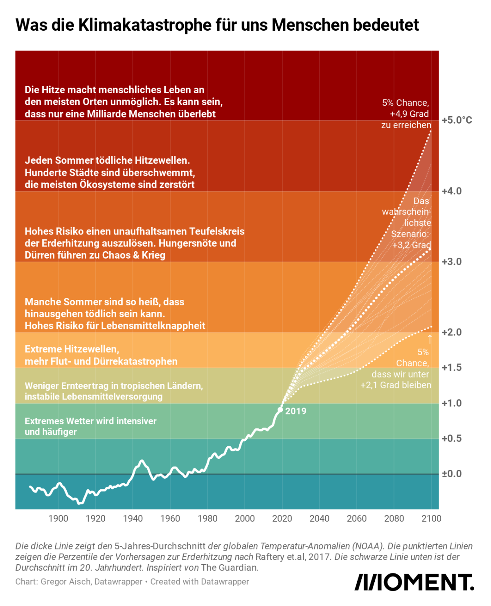

import TwoClickPrivacyEmbed from "../../../components/TwoClickPrivacyEmbed.svelte";

Spätestens seit Ende Juli gibt es leider die Gewissheit, dass die globale Erderhitzung nicht mehr auf 1,5-Grad begrenzt werden kann - trotz des Pariser Klimaabkommens:

> Geht es nach dem neuen Chef des UNO-Klimarates (IPCC), Jim Skea, sei klar, dass man die Pariser Klimaziele nicht mehr erreichen werde. Trotzdem zahle sich der Kampf gegen den CO2-Ausstoß aus. [..] Die Regierungen hätten keine Maßnahmen ergriffen, die ehrgeizig genug gewesen seien, um die Ziele des Pariser Klimaabkommens umzusetzen.

  [„Neuer IPCC-Chef: Pariser Klimaziele nicht mehr
  erreichbar“](https://orf.at/stories/3325440/) - orf.at, 27.07.2023

Die 1,5-Grad-Grenze könnte schon in den nächsten fünf Jahren erstmalig überschritten werden (bis 2027). (<a href="https://science.orf.at/stories/3219374/">Quelle</a>)

Ebenso äußerte sich der langjährige Klimaforscher, Stefan Rahmstorf im [Deutschlandfunk](https://www.deutschlandfunk.de/es-mangelt-am-willen-klimaforscher-rahmstorf-haelt-1-5-grad-ziel-politisch-kaum-noch-fuer-erreichbar-100.html):

> Physikalisch kann man es noch erreichen, aber dazu müsste man eben es anpacken, wie, wenn man in einer Kriegssituation ist und das einfach die TopPriorität hat, die 1,5 Grad zu halten. Realistisch ist es natürlich so, dass die allermeisten Regierungen das eben leider nicht als Top-Priorität behandeln und so werden wir es auf keinen Fall schaffen.

  [„Es mangelt am Willen“ – Klimaforscher Rahmstorf hält 1,5-Grad-Ziel politisch
  kaum noch für
  erreichbar“](https://www.deutschlandfunk.de/es-mangelt-am-willen-klimaforscher-rahmstorf-haelt-1-5-grad-ziel-politisch-kaum-noch-fuer-erreichbar-100.html)
  \- Deutschlandfunk, 30.07.2023

## Was passiert bei über 1,5 Grad?

Der neue IPCC-Vorsitzende, Jim Skea, sagte am 29. Juli 2023:

> "Trotzdem sollten wir nicht verzweifeln, wenn die Welt die 1,5 Grad überschreitet." Die Welt werde dann nicht untergehen. "Es wird jedoch eine gefährlichere Welt sein. Die Länder werden mit vielen Problemen kämpfen, es wird soziale Spannungen geben."

> Für besonders wichtig hält der Forscher den Ausbau der erneuerbaren Energien, um klimaschädliche Kohlekraftwerke, Gasheizungen oder Erdöl in Industrie und Verkehr zu ersetzen. Auch auf Lösungen wie die umstrittene unterirdische Speicherung von Kohlendioxid könne man längerfristig nicht verzichten.

> "Engagiert euch!", sagte Skea an die Adresse aller Erdenbürger. "Sitzt nicht auf dem Sofa und schaut den Debatten über den Klimawandel zu. Jeder Einzelne kann etwas tun." Skea verwies auf Bürgerinitiativen, aber auch Bürgerdialoge städtischer Behörden oder Wahlen auf kommunaler Ebene. Der Weltklimarat (IPCC) müsse selbst auch mehr tun, um seine spezifischen Erkenntnisse besser als Handlungsgrundlage für bestimmte Gruppen aufzubereiten."

  Quelle: IPCC-Vorsitzender Jim Skea -
  [tagesschau.de](https://www.tagesschau.de/ausland/skea-weltklima-100.html)
  (29.07.2023),
  [Spiegel-Interview](https://www.spiegel.de/wissenschaft/ipcc-chef-jim-skea-bei-1-5-grad-erwaermung-geht-die-welt-nicht-unter-a-13dd35aa-1a80-41b8-b966-911015fd9085)

Mit dem Überschreiten von 1,5-Grad - sowie gegebenfalls auch 2-Grad in Zukunft - werden auch die Folgen für die Menschheit potenziell gravierender, hier eine vereinfachte Darstellung:

  Quelle / Urheberrechte:{" "}
  <a href="https://www.moment.at/story/klimakrise-so-heiss-koennte-es-deinem-leben-noch-werden">
    moment.at - So heiß könnte es in deinem Leben noch werden (Juli 2021)
  </a>

## Gesellschaftliche Herausforderungen

Die Menschheit wird sich zukünftig also potenziell schwierigen, in dieser Form noch nie
dagewesenen Herausforderungen stellen müssen auf einem veränderten Planeten. Es wird wohl
insbesondere auf Werte wie Solidarität ankommen in Zukunft (persönliche These).

Sascha Friesike verweist hierbei auch darauf, dass es sich bei der Klimakrise um eine zeitlich
entgrenzte "creeping crisis" handelt. Hiermit sinnvoll umgehen zu können, muss laut Friesike
auch von Gesellschaften erst erlernt werden:

<TwoClickPrivacyEmbed
  provider="youtube"
  contentId="c8uZbS_wWPI"
  client:visible
/>

  Video:{" "}
  <a href="https://www.youtube.com/watch?v=c8uZbS_wWPI">
    Krise, was ist das eigentlich? | Wissenschaft erklärt
  </a>

## Jedes Zehntelgrad weniger Erhitzung ist wichtig

Selbst beim Überschreiten von 1,5 °C oder 2 °C Erhitzung bringt es weiterhin etwas, jedes weitere
Zehntelgrad Erhitzung zu verhindern.

> Skea plädierte dafür, sich weniger auf das 1,5-Grad-Ziel zu konzentrieren: „Ich glaube, wir haben uns ein bisschen zu viel auf diese ikonischen Ziele fixiert wie die 1,5 Grad.“ Die Botschaft des letzten IPCC-Berichts sei klar: „Egal an welchem Punkt wir uns befinden – die Vorteile, etwas gegen den CO2-Ausstoß zu tun, übertreffen bei Weitem die Kosten, die mit der CO2-Reduktion verbunden sind“, so Skea. „Es zahlt sich weiterhin aus, etwas zu unternehmen, außer man will, dass es noch schlimmer wird als derzeit“, machte Skea klar, dass ein Aufgeben im Kampf gegen die menschengemachte Klimaerwärmung aus seiner Sicht keine Option ist.

  [„Neuer IPCC-Chef: Pariser Klimaziele nicht mehr
  erreichbar“](https://orf.at/stories/3325440/) - orf.at, 27.07.2023

Dies wurde auch noch einmal in Bezug auf die Hamburger Studie „Hamburg Climate Futures Outlook 2023“ von den
AutorInnen [im Deutschlandfunk](https://www.deutschlandfunk.de/erreichen-des-1-5-grad-ziels-unplausibel-100.html) betont. Die Studie kam ebenfalls zu dem Ergebnis, dass das 1,5-Grad-Ziel nicht mehr realistisch erreichbar ist:

> Für jedes halbe Grad zusätzlicher Globalerwärmung bekommen wir eine deutlich wahrnehmbarere Risikozunahme durch Hitzewellen, Überschwemmungen und Dürren. Und das bedeutet: Egal, welches Maß an globaler Erwärmung bereits geschehen ist – man mindert immer das weitere Risiko, indem man weitere Erwärmung verhindert.“

  Jochem Marotzke, Direktor am Max-Planck-Institut für Meteorologie -
  [Deutschlandfunk](https://www.deutschlandfunk.de/erreichen-des-1-5-grad-ziels-unplausibel-100.html)
  (2023)

## Mehr Informationen

<TwoClickPrivacyEmbed
  provider="youtube"
  contentId="V0TPithzs-A"
  placeholderImg="{base}/images/screenshot_youtube_rahmstorf_1_5_grad.png"
/>

  Video:{" "}
  <a href="https://youtu.be/V0TPithzs-A">
    Re-Upload: Können wir 1,5 Grad Erderwärmung überhaupt noch einhalten?
  </a>
  (Original-Quelle:
  <a href="https://twitter.com/rahmstorf/status/1593495465261256707">
    Stefan Rahmstorf - Twitter
  </a>
  , gesamte Diskussion:
  <a href="https://www.youtube.com/watch?v=xrdKdlZRb5M">
    Europe Calling Live von der Klimakonferenz #cop27 - Disaster oder
    Hoffnungsschimmer? (YouTube)
  </a>

### Studie "Hamburg Climate Futures Outlook 2023"

Physikalisch also noch definitiv machbar - praktisch (politisch,
wirtschaftlich und sozial) aber nicht mehr erreichbar. Zu diesem Ergebnis kam
auch laut Medienberichten die Studie
["Hamburg Climate Futures Outlook 2023"](https://www.cliccs.uni-hamburg.de/de/results/hamburg-climate-futures-outlook/download.html)
. Der Standard zitiert die SprecherInnen hierzu:

<blockquote>
  Ein neuer Bericht des Hamburger Climate, Climatic Change and Society Clusters
  Cliccs, an dem über 60 Fachleute beteiligt waren, kommt nun zum Schluss, dass
  ein Erreichen dieses Ziels, trotz positiver Entwicklungen, inzwischen
  unplausibel ist. "Tatsächlich ist in Sachen Klimaschutz inzwischen einiges in
  Bewegung geraten. Aber wenn man sich die Entwicklung der gesellschaftlichen
  Prozesse im Detail ansieht, ist eine Begrenzung der Erderwärmung auf unter 1,5
  Grad immer noch nicht plausibel", sagt Cliccs-Sprecherin Anita Engels.
   
   
  Zwar gebe es positive Entwicklungen, etwa die Klimapolitik der Vereinten Nationen
  und den voranschreitenden Ausstieg aus fossilen Brennstoffen. Doch das genüge nicht,
  weil der gesellschaftliche Wandel nicht schnell genug voranschreite. Vor allem
  das Konsumverhalten und die Reaktionen von Unternehmen würden dringend benötigte
  Maßnahmen verlangsamen. Die Rolle der Medien sei ambivalent: Manche hätten im betrachteten
  Rahmen einen positiven Effekt, manche einen negativen. "Die erforderliche tiefgreifende
  Dekarbonisierung geht einfach zu langsam voran", sagt Engels.
   
  
    Quelle:{" "}
    <a href="https://www.instagram.com/p/CoHsCG3NJw9/?hl=de">
      @derstandard (02. Februar 2023)
    </a>
  
</blockquote>
