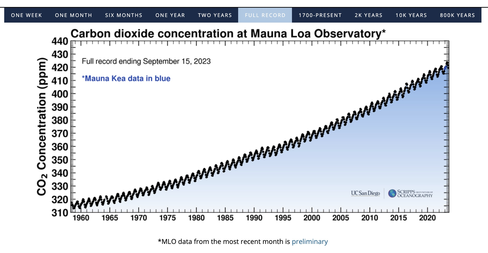
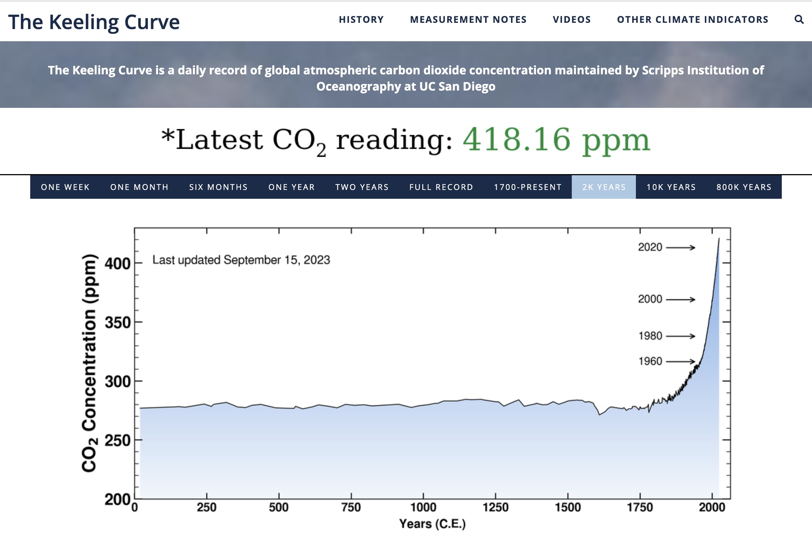

Seit 1958 wird der Treibhausgas-Anteil in der Atmosphäre regelmäßig wissenschaftlich
gemessen. Hier gibt es seit 1958 jedes Jahr die selbe Meldung: Auch 2022 stieg der Anteil
von Treibhausgasen in der Atmosphäre weiter an:

  Grafik-Quelle:{" "}
  <a href="https://keelingcurve.ucsd.edu/">
    Keeling Curve, Scripps Institution of Oceanography at UC San Diego
  </a>

Die Wissenschaft hat - basierend auf Erdbohrungen, etc. - auch rekonstruiert, ob es in der näheren Vergangenheit schon eine vergleichbar hohe CO2-Menge in der Atmosphäre der Erde gab:

Nach bisherigen Erkenntnissen gab es in den letzten 800'000 Jahren keine so hohe CO2-Konzentration in der Atmosphäre, wie sie jetzt vorzufinden ist:

> Im Mai 2021 lag der durchschnittliche globale Wert für atmosphärisches CO2 bei 415 ppm. Das letzte Mal, dass so viel CO2 in der Atmosphäre war, liegt mehrere Millionen Jahre zurück, als an den modernen Menschen überhaupt noch nicht zu denken war und der Meeresspiegel durchschnittlich 30 Meter höher lag.

  https://www.dw.com/de/faktencheck-klimawandel-ist-globale-erw%C3%A4rmung-nat%C3%BCrlicher-prozess/a-57876170

> By drilling for ice cores and analyzing the air bubbles, scientists have found that, at no point during at least the past 800,000 years have atmospheric CO2 levels been as high as they are now.
> https://www.climatecentral.org/news/the-last-time-co2-was-this-high-humans-didnt-exist-15938

## Mehr Informationen

  Mehr Informationen u.a. bei{" "}
  <a href="https://www.zdf.de/dokumentation/terra-x/themenpaket-klimawandel-forschung-100.html">
    TerraX (ZDF).
  </a>

