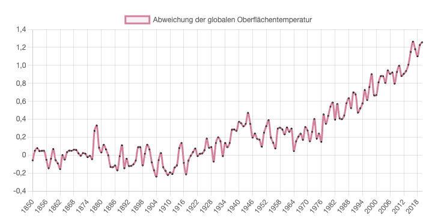

import ChartGlobalTempChange from "../../../components/ChartGlobalTempChange.svelte";
import TwoClickPrivacyEmbed from "../../../components/TwoClickPrivacyEmbed.svelte";

<ChartGlobalTempChange client:load />

Unser Planet hat sich im Durchschnitt bereits um + 1,1 °C erhitzt.

  Daten-Quelle für das Diagramm:
  [gmst_changes_model_and_obs.csv](https://data.ceda.ac.uk/badc/ar6_wg1/data/spm/spm_01/v20221116/panel_b)
  (Spalte 8 "Global Surface Temperature Anomalies [GSTA] relative to 1850-1900
  from observations assessed in IPCC AR6 WG1 Chapter 2") via [Figure SPM.1 -
  IPCC
  AR6](https://www.ipcc.ch/report/ar6/wg1/figures/summary-for-policymakers/figure-spm-1/)
  (2021)

Im <a href="https://www.de-ipcc.de/media/content/AR6-WGI-SPM_deutsch_barrierefrei.pdf">
Sechsten Sachstandsbericht (AR6 = Sixth Assessment Report, 2021)</a> des IPCC heißt es:

> „Es ist eindeutig, dass der Einfluss des Menschen die Atmosphäre, den Ozean und die Landflächen erwärmt hat. Es haben weitverbreitete und schnelle Veränderungen in der Atmosphäre, dem Ozean, der Kryosphäre und der Biosphäre stattgefunden. [...] Jedes der vergangenen vier Jahrzehnte war jeweils wärmer als alle Jahrzehnte davor seit 1850. [...]{" "} **Die globale Oberflächentemperatur war im Zeitraum 2011–2020 um 1,09 [0,95–1,20] °C höher als 1850–1900** [.]“

  Quelle: [IPCC AR6 - Klimawandel 2021 Naturwissenschaftliche Grundlagen
  Zusammenfassung für die politische
  Entscheidungsfindung](https://www.de-ipcc.de/media/content/AR6-WGI-SPM_deutsch_barrierefrei.pdf),
  S.3, 2021

## Was bedeutet "Erderhitzung" genau?

Mit der Erhitzung ist der „Anstieg der Durchschnittstemperatur der erdnahen Atmosphäre und
der Meere“ gemeint. Verglichen wird die Durchschnittstemperatur mit der vorindustriellen
Zeit - also bevor die Industralisierung mit Maschinen, Fabriken, etc. begann. Da es damals
noch wenig umfangreiche Temperatur-Messdaten gab, verwendet der Weltklimarat (IPCC) hierfür
die Zeit 1850-1900 als Annäherung ([Quelle](https://www.klimafakten.de/meldung/ein-grad-anderthalb-zwei-grad-umrechnungs-tabellen-fuer-temperaturangaben-zur-erderhitzung))

Von [klimadashboard.at](https://klimadashboard.at) habe ich die Formulierung "Erderhitzung" übernommen:

> Wir verwenden das Wort 'Erhitzung' anstatt 'Erwärmung' da es sprachlich gesehen deutlicher macht, wie viel Unterschied zwischen jedem Zehntel-Grad zusätzlicher Erhitzung für das Weltklima, die Artenvielfalt und das gesellschaftliche Zusammenleben besteht.

## Wodurch wird die Erhitzung verursacht?

Treibhausgas wie Kohlenstoffdioxid wird vom Menschen (durch Industrie, Heizen, Mobilität, etc.) massenhaft in die Atmosphäre entlassen und verhindert dort die Abstrahlung von Sonnenwärme:

<TwoClickPrivacyEmbed
  provider="youtube"
  contentId="nEvWK3-UOis"
  client:visible
/>

  Video: [ How is CO2 warming up the
  planet?](https://www.youtube.com/shorts/nEvWK3-UOis) (Deutsche Welle, Planet
  A)

Kurz zusammengefasst wird dies bspw. auch hier:

> Die Verbrennung fossiler Brennstoffe, die Abholzung von Wäldern und die Viehzucht beeinflussen zunehmend das Klima und die Temperatur auf der Erde.

  Quelle: [Europäische Kommission - Climate
  Action](https://climate.ec.europa.eu/climate-change_de)

> Haupttriebfeder des Klimawandels ist der Treibhauseffekt. Einige in der Erdatmosphäre vorhandene Gase wirken ungefähr wie das Glas eines Gewächshauses: Sie lassen Sonnenwärme zwar herein, verhindern aber ihre Abstrahlung zurück in den Weltraum und führen zur Erderwärmung. Viele dieser Treibhausgase sind natürliche Bestandteile der Erdatmosphäre; infolge menschlicher Tätigkeiten ist jedoch die Konzentration einiger Gase stark angestiegen. Das gilt insbesondere für:
>
> - Kohlendioxid (CO2) 
> - Methan 
> - Distickstoffoxid 
> - Fluorierte Gase 

  Quelle: [Europäische Kommission - Climate
  Action](https://climate.ec.europa.eu/climate-change_de)

## Mehr Informationen

- https://www.klimafakten.de/behauptungen/behauptung-es-gibt-noch-keinen-wissenschaftlichen-konsens-zum-klimawandel
