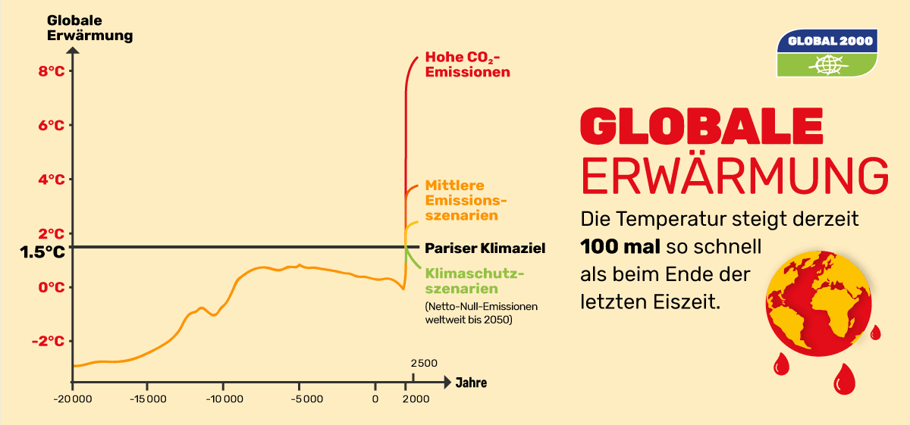
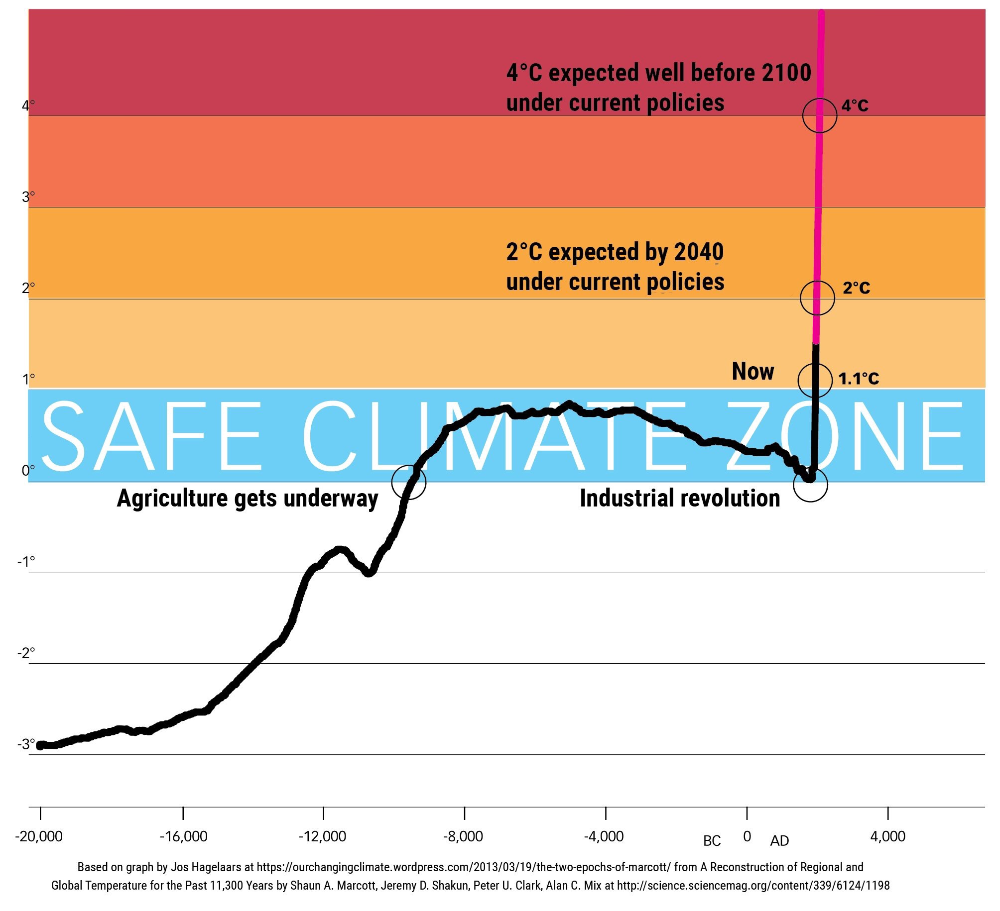
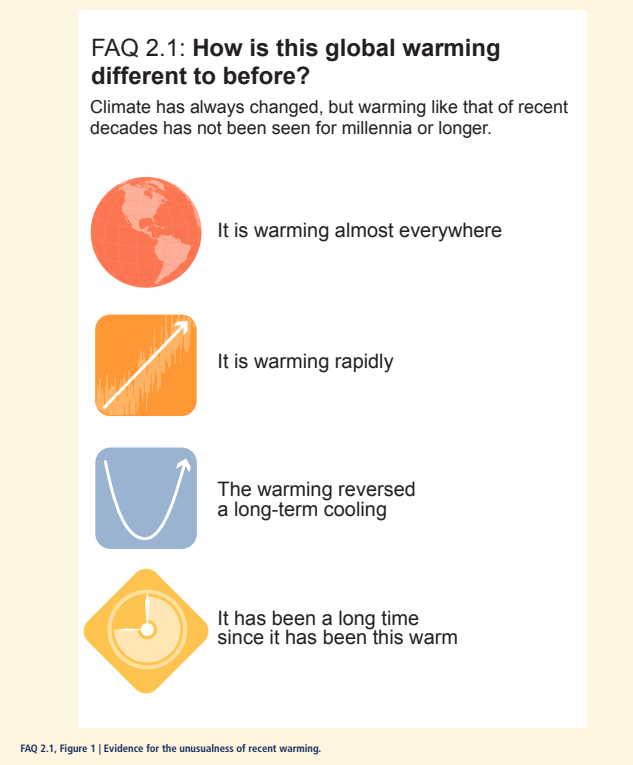
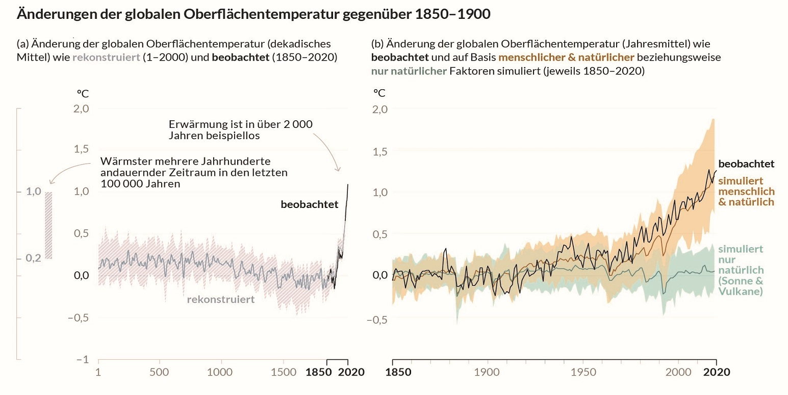

Das Klima auf dem Planeten hat sich stets geändert, aber laut wissenschaftlicher Forschung gibt es bedeutsame Unterschiede zur jetzigen Situation:

  Quelle: [Infografik GLOBAL 2000 / Kerstin Jana
  Kater](https://www.global2000.at/themen/klimawandel) von
  [global2000.at/themen/klimawandel](https://www.global2000.at/themen/klimawandel),
  Copyright: Global2000

Die klimatischen Bedingungen, in denen die Menschheit die letzten Jahrtausende gelebt und Zivilisationen aufgebaut hat, werden verlassen:

  Grafik aus 2018, inzwischen hat sich die aktuelle Pfad-Prognose auf +3,2°C
  verbessert.
  [Quelle](https://jpratt27.wordpress.com/2018/12/04/sir-david-attenborough-climatechange-our-greatest-threat-auspol-qldpol-heatwave-bushfire-flood-stopadani-climatestrike-extinctionrebellion-thedrum-qanda-cop24/)

Im sechsten Sachstandsbericht des IPCC (AR6, 2021 - Häufig gestellte Fragen) wird dies so beschrieben:

  [Quelle](https://www.ipcc.ch/report/ar6/wg1/chapter/chapter-2#faq-2-1/#),
  [PDF](https://www.ipcc.ch/report/ar6/wg1/downloads/faqs/IPCC_AR6_WGI_FAQs_Compiled.pdf)

> It’s been a long time since it’s been this warm. Averaged over the globe, surface temperatures of the past decade were probably warmer than when the long cooling trend began around 6500 years ago. If so, we need to look back to at least the previous interglacial period, around 125,000 years ago, to find evidence for multi-centennial global surface temperatures that were warmer than now. [Quelle](https://www.ipcc.ch/report/ar6/wg1/chapter/chapter-2#faq-2-1)

Deutschsprachige Grafik:

[Quelle](https://www.de-ipcc.de/360.php)

## Mehr Informationen

- https://www.klimafakten.de/behauptungen/behauptung-das-klima-hat-sich-immer-schon-gewandelt
